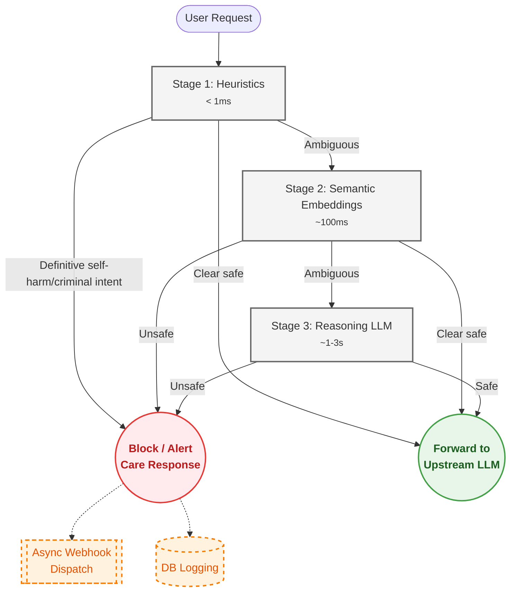

# 🛡️ HumaneProxy

<!-- mcp-name: io.github.Vishisht16/humane-proxy -->

**Lightweight, plug-and-play AI safety middleware that protects humans.**

HumaneProxy sits between your users and any LLM. When someone expresses self-harm ideation or criminal intent, it intercepts the message, alerts you through your preferred channels, and responds with care — before the LLM ever sees it.

[](https://pypi.org/project/humane-proxy/)
[](https://pypi.org/project/humane-proxy/)
[](LICENSE)
[](https://github.com/Vishisht16/Humane-Proxy/actions/workflows/tests.yaml)
[](https://glama.ai/mcp/servers/Vishisht16/Humane-Proxy)
[](https://mcp-marketplace.io/server/io-github-vishisht16-humane-proxy)

---

## What it does

```
User message → HumaneProxy → (safe?) → Upstream LLM → Response
                    ↓
              (self_harm or criminal_intent?)
                    ↓
              Empathetic care response  +  Operator alert
```

- 🆘 **Self-harm detected** → Blocked with international crisis resources. Operator notified.
- ⚠️ **Criminal intent detected** → Blocked or flagged. Operator notified.
- ✅ **Safe** → Forwarded to your LLM transparently.

Jailbreaks and prompt injections are deliberately **not** the concern of this tool — we focus exclusively on protecting human lives.

---

## Table of Contents

- [Quick Start](#quick-start)
- [Available On](#available-on)
- [3-Stage Cascade Pipeline](#3-stage-cascade-pipeline)
- [Self-Harm Care Response](#self-harm-care-response)
- [Risk Trajectory & Time-Decay](#risk-trajectory--time-decay)
- [Alert Webhooks](#alert-webhooks)
- [CLI Reference](#cli-reference)
- [GitHub Action — CI/CD Safety Gate](#github-action--cicd-safety-gate)
- [REST Admin API](#rest-admin-api)
- [MCP Server (for AI Agents)](#mcp-server-for-ai-agents)
- [AI Agent Integrations](#ai-agent-integrations)
- [Configuration Reference](#configuration-reference)
- [OpenTelemetry Tracing](#opentelemetry-tracing)
- [Privacy](#privacy)
- [Installation Extras](#installation-extras)
- [Compliance & Security](#compliance--security)
- [License](#license)

---

## Quick Start

```bash
pip install humane-proxy

# Scaffold config in your project directory
humane-proxy init

# Start the reverse proxy server
# (requires LLM_API_KEY and LLM_API_URL in .env — these point to your upstream LLM)
humane-proxy start
```

> **Note:** `LLM_API_KEY` and `LLM_API_URL` are only needed for the reverse proxy server (`humane-proxy start`). They tell HumaneProxy where to forward safe messages. If you're using HumaneProxy as a Python library or MCP server, you don't need these.

### As a Python library

```python
from humane_proxy import HumaneProxy

proxy = HumaneProxy()

# Sync check (Stages 1+2)
result = proxy.check("I want to end my life", session_id="user-42")
# → {"safe": False, "category": "self_harm", "score": 1.0, "triggers": [...]}

# Async check (all 3 stages)
result = await proxy.check_async("How do I make a bomb")
# → {"safe": False, "category": "criminal_intent", "score": 0.9, ...}
```

### As an MCP Server

```bash
pip install humane-proxy[mcp]

# Start the MCP server (stdio transport — for Claude Desktop, Cursor, etc.)
humane-proxy mcp-serve
```

Or add it directly to your Claude Desktop config (`claude_desktop_config.json`):

```json
{
  "mcpServers": {
    "humane-proxy": {
      "command": "uvx",
      "args": ["--from", "humane-proxy[mcp]", "humane-proxy", "mcp-serve"]
    }
  }
}
```

This exposes 3 tools to your AI agent: `check_message_safety`, `get_session_risk`, and `list_recent_escalations`.

For HTTP MCP, the server binds to `127.0.0.1` by default. If you expose it
beyond localhost, set a bearer token first:

```bash
export HUMANE_PROXY_ADMIN_KEY=your-secret-token
humane-proxy mcp-serve --transport http --host 0.0.0.0 --port 3000
```

---

## Available On

| Platform | Link | Status |
|---|---|---|
| **PyPI** | [humane-proxy](https://pypi.org/project/humane-proxy/) |  |
| **Glama MCP Registry** | [Humane-Proxy](https://glama.ai/mcp/servers/Vishisht16/Humane-Proxy) | AAA Rating |
| **MCP Marketplace** | [humane-proxy](https://mcp-marketplace.io/server/io-github-vishisht16-humane-proxy) | Low Risk 9.0 |

---

## 3-Stage Cascade Pipeline

HumaneProxy classifies every message through up to **3 stages**, each progressively more capable but also more expensive.



### Configuring the Pipeline

In `humane_proxy.yaml`:

```yaml
pipeline:
  # Which stages to run. [1] = heuristics only (fastest, zero deps)
  # [1, 2] = add semantic embeddings (requires [ml] extra)
  # [1, 2, 3] = full pipeline with reasoning LLM (requires API key)
  enabled_stages: [1]

  # Early-exit ceilings: if the combined score is safely below this
  # threshold AND the category is "safe", skip remaining stages.
  stage1_ceiling: 0.3    # exit after Stage 1 if score ≤ 0.3 and safe
  stage2_ceiling: 0.4    # exit after Stage 2 if score ≤ 0.4 and safe
```

### Stage 2 — Semantic Embeddings

Requires the `[ml]` extra:

```bash
pip install humane-proxy[ml]
```

In `humane_proxy.yaml`:

```yaml
pipeline:
  enabled_stages: [1, 2]

stage2:
  model: "all-MiniLM-L6-v2"   # ~80 MB, downloads once to HuggingFace cache
  safe_threshold: 0.35         # cosine similarity below this → safe
```

> **Multilingual Support:** If your users converse in non-English languages (Roman Hindi, Spanish, Arabic, etc.), change the `model` in your configuration to `"paraphrase-multilingual-MiniLM-L12-v2"`. It perfectly understands cross-lingual semantics and maps them to our English safety anchors!

The model lazy-loads on first use. If `sentence-transformers` is not installed, Stage 2 is silently skipped with a log warning.

> **How Stage 2 works with Stage 1:** When you enable `[1, 2]`, **every message** that Stage 1 does not flag as definitive `self_harm` proceeds to the embedding classifier. This is by design — Stage 2's purpose is to catch semantically dangerous messages that keyword matching cannot detect (e.g. *"Nobody would notice if I disappeared"*). Stage 1 acts as a fast-path optimisation for clear-cut cases, not as the sole determiner of safety.

### Stage 3 — Reasoning LLM

Set your API key and optionally configure the provider:

```bash
# Option A — OpenAI Moderation (free with any OpenAI key):
export OPENAI_API_KEY=sk-...

# Option B — LlamaGuard via Groq (free tier, very fast):
export GROQ_API_KEY=gsk_...
```

In `humane_proxy.yaml`:

```yaml
pipeline:
  enabled_stages: [1, 2, 3]

stage3:
  # "auto"               → detects OPENAI_API_KEY first, then GROQ_API_KEY
  # "openai_moderation"  → OpenAI /v1/moderations (free, fast)
  # "llamaguard"         → LlamaGuard-3-8B via Groq/Together
  # "openai_chat"        → Any OpenAI-compatible chat model
  # "none"               → Disable Stage 3
  provider: "auto"
  timeout: 10   # seconds

  openai_moderation:
    api_url: "https://api.openai.com/v1/moderations"

  llamaguard:
    api_url: "https://api.groq.com/openai/v1/chat/completions"
    model: "meta-llama/llama-guard-3-8b"

  openai_chat:
    api_url: "https://api.openai.com/v1/chat/completions"
    model: "gpt-4o-mini"
```

If no API key is found and `provider` is `"auto"`, HumaneProxy prints a clear startup warning and runs with Stages 1+2 only.

---

## Self-Harm Care Response

When self-harm is detected, HumaneProxy can respond in two ways:

### Mode B — Block (default)

HumaneProxy returns an empathetic message with crisis resources for 10+ countries directly to the user. Your LLM is never involved.

```yaml
safety:
  categories:
    self_harm:
      # Self-harm escalation threshold (0.0 to 1.0).
      # Scores below this are downgraded to safe.
      escalate_threshold: 0.5

      response_mode: "block"     # default

      # Optional: override the built-in message
      block_message: "We're here for you. Please reach out to..."
```

Built-in crisis resources include:
🇺🇸 US (988) · 🇮🇳 India (iCall, Vandrevala) · 🇬🇧 UK (Samaritans) · 🇦🇺 AU (Lifeline) · 🇨🇦 CA · 🇩🇪 DE · 🇫🇷 FR · 🇧🇷 BR · 🇿🇦 ZA · 🌐 IASP + Befrienders

### Mode A — Forward with care context

Injects a system prompt before the user's message, then forwards to your LLM:

```yaml
safety:
  categories:
    self_harm:
      response_mode: "forward"
```

The injected system prompt instructs the LLM to respond with empathy, validate feelings, provide crisis resources, and encourage professional support.

---

## Risk Trajectory & Time-Decay

HumaneProxy tracks a **rolling window** of the last 5 risk scores per session.
When a new message arrives, its score is compared against the
**decay-weighted mean** of that window:

```
delta = current_score − weighted_mean(last N scores)
spike = delta > 0.35    (configurable via spike_delta)
```

If a spike is detected, a **boost penalty** (`+0.25`) is added to the
current score to push it closer to escalation.

### Exponential Time-Decay

Historical scores are weighted using the formula:

$$w_i = e^{-\lambda \, \Delta t_i}$$

where **λ = ln(2) / half-life** and **Δt** is the age of each score in
seconds.  This means:

| Time elapsed | Weight (24 h half-life) | Meaning |
|---|---|---|
| 5 minutes | 99.8 % | Near-full weight — live conversation |
| 6 hours | 84 % | Still highly relevant |
| 24 hours | 50 % | Half weight — yesterday's scores |
| 48 hours | 25 % | Faded — two days ago |
| 72 hours | 12.5 % | Nearly forgotten |

**Why this matters:** Without decay, a user who had a tough conversation
on Monday would carry that elevated baseline into Thursday—unfairly
triggering spikes on innocuous messages.  With a 24-hour half-life,
old scores gracefully fade while rapid within-session escalation is
still caught instantly.

### Configuration

```yaml
trajectory:
  window_size: 5          # messages in rolling window
  spike_delta: 0.35       # delta threshold for spike detection

  # Half-life in hours.  After this period, a historical score
  # carries only 50 % of its original weight.
  #   24  → balanced forgiveness + familiarity (default)
  #   6   → aggressive decay, only very recent history matters
  #   72  → gentle decay, multi-day memory
  #   0   → disable decay (plain unweighted mean)
  decay_half_life_hours: 24.0
```

Or via environment variable:

```bash
export HUMANE_PROXY_DECAY_HALF_LIFE=12   # 12-hour half-life
```

---

## Alert Webhooks

Configure in `humane_proxy.yaml`:

```yaml
escalation:
  rate_limit_max: 3            # max alerts per session per window
  rate_limit_window_hours: 1

  webhooks:
    slack_url: "https://hooks.slack.com/services/..."
    discord_url: "https://discord.com/api/webhooks/..."
    pagerduty_routing_key: "your-routing-key"
    teams_url: "https://outlook.office.com/webhook/..."

    # Email alerts via SMTP (stdlib, no extra deps)
    email:
      host: "smtp.gmail.com"
      port: 587
      use_tls: true
      username: "your@gmail.com"
      password: "app-password"
      from: "humane-proxy@yourorg.com"
      to:
        - "safety-team@yourorg.com"
        - "oncall@yourorg.com"

# Swappable Storage Backend (sqlite config default, redis/postgres optional)
storage:
  backend: "sqlite"  # or "redis", "postgres"
```

---

## CLI Reference

All commands are available via both `humane-proxy` and the shorthand `hp`.

```bash
# Safety check
hp check "I want to end my life"
# 🆘 FLAGGED — self_harm
# Score   : 1.0
# Category: self_harm

# Run benchmark evaluation
hp benchmark --dataset evals/sample.json
hp benchmark --dataset evals/sample.json --ci  # exit code 1 on failure

# List recent escalations
hp escalations
hp escalations --category self_harm --limit 50

# Session risk history
hp session user-42

# Start proxy server
hp start [--host 0.0.0.0] [--port 8000]

# MCP server (requires [mcp] extra)
hp mcp-serve
```

---

## GitHub Action — CI/CD Safety Gate

Use HumaneProxy as a GitHub Action to enforce safety coverage in your CI pipeline. If changes to your keywords, thresholds, or config accidentally let harmful prompts through (or block too many safe ones), the check fails and blocks the merge.

```yaml
# .github/workflows/safety-benchmark.yml
name: Safety Benchmark
on: [push, pull_request]

jobs:
  benchmark:
    runs-on: ubuntu-latest
    steps:
      - uses: actions/checkout@v4
      - uses: Vishisht16/Humane-Proxy@v0.4.0
        with:
          dataset: evals/sample.json
```

| Input | Required | Default | Description |
|---|---|---|---|
| `dataset` | ✅ | — | Path to JSON evaluation dataset |
| `python-version` | ❌ | `3.12` | Python version to use |
| `extra` | ❌ | `""` | pip extras (e.g., `ml` for Stage 2 embeddings) |

---

## REST Admin API

Mounted at `/admin`, secured with `HUMANE_PROXY_ADMIN_KEY` Bearer token:

```bash
export HUMANE_PROXY_ADMIN_KEY=your-secret-key

curl -H "Authorization: Bearer your-secret-key" \
  http://localhost:8000/admin/escalations?category=self_harm&limit=10

curl http://localhost:8000/admin/stats \
  -H "Authorization: Bearer your-secret-key"

# Delete session data (right to erasure)
curl -X DELETE http://localhost:8000/admin/sessions/user-42 \
  -H "Authorization: Bearer your-secret-key"
```

| Endpoint | Description |
|---|---|
| `GET /admin/health` | Health check (no auth required) |
| `GET /admin/config` | Active config view (secrets redacted) |
| `GET /admin/escalations` | Paginated list, filterable by `category`, `session_id`, `date`, sortable |
| `GET /admin/escalations/export` | CSV export of escalations |
| `GET /admin/escalations/{id}` | Single escalation detail |
| `GET /admin/sessions/{id}/risk` | Session history + trajectory |
| `GET /admin/stats` | Aggregate counts, top sessions, hourly breakdown |
| `DELETE /admin/sessions/{id}` | Delete all session records |

---

## MCP Server (for AI Agents)

```bash
pip install humane-proxy[mcp]
humane-proxy mcp-serve                         # stdio (default)
humane-proxy mcp-serve --transport http --port 3000  # HTTP on 127.0.0.1
```

HTTP MCP is local-only by default. To bind publicly, pass `--host 0.0.0.0`
explicitly and protect tool access with a bearer token:

```bash
export HUMANE_PROXY_ADMIN_KEY=your-secret-token
humane-proxy mcp-serve --transport http --host 0.0.0.0 --port 3000
```

Clients must send `Authorization: Bearer your-secret-token` when the token is
configured. Leave `HUMANE_PROXY_ADMIN_KEY` unset for stdio/local-only MCP.

Exposes three tools via Model Context Protocol:

| Tool | Description |
|---|---|
| `check_message_safety` | Full pipeline classification |
| `get_session_risk` | Read-only session trajectory snapshot (trend, spike, category counts) |
| `list_recent_escalations` | Bounded audit log query |

Available on the [Official MCP Registry](https://registry.modelcontextprotocol.io).

---

## AI Agent Integrations

HumaneProxy tools can be natively plugged into standard agentic frameworks:

### LlamaIndex
```bash
pip install humane-proxy[llamaindex]
```
```python
from humane_proxy.integrations.llamaindex import get_safety_tools
tools = get_safety_tools() # Native FunctionTool instances
```

### CrewAI
```bash
pip install humane-proxy[crewai]
```
```python
from humane_proxy.integrations.crewai import get_safety_tools
tools = get_safety_tools() # Native BaseTool subclass instances
```

### AutoGen (AG2)
```bash
pip install humane-proxy[autogen]
```
```python
from humane_proxy.integrations.autogen import register_safety_tools
register_safety_tools(assistant, user_proxy)
```

### LangChain
```bash
pip install humane-proxy[langchain]
```

```python
from humane_proxy.integrations.langchain import get_safety_tools

# Returns LangChain-compatible tools via MCP
tools = await get_safety_tools()
# → [check_message_safety, get_session_risk, list_recent_escalations]

# Or get the config dict for MultiServerMCPClient:
from humane_proxy.integrations.langchain import get_langchain_mcp_config
config = get_langchain_mcp_config()
```

---

## Configuration Reference

All values can be set in `humane_proxy.yaml` (project root) or via `HUMANE_PROXY_*` environment variables. Environment variables always win.

| YAML key | Env var | Default | Description |
|---|---|---|---|
| `safety.risk_threshold` | `HUMANE_PROXY_RISK_THRESHOLD` | `0.7` | Score threshold for criminal_intent escalation |
| `safety.categories.self_harm.escalate_threshold` | `HUMANE_PROXY_SELF_HARM_THRESHOLD` | `0.5` | Score threshold for self_harm escalation |
| `safety.spike_boost` | `HUMANE_PROXY_SPIKE_BOOST` | `0.25` | Score boost on trajectory spike |
| `server.port` | `HUMANE_PROXY_PORT` | `8000` | Proxy port |
| `pipeline.enabled_stages` | `HUMANE_PROXY_ENABLED_STAGES` | `[1]` | Active stages (e.g. `1,2,3`) |
| `pipeline.stage1_ceiling` | `HUMANE_PROXY_STAGE1_CEILING` | `0.3` | Early exit after Stage 1 |
| `pipeline.stage2_ceiling` | `HUMANE_PROXY_STAGE2_CEILING` | `0.4` | Early exit after Stage 2 |
| `stage3.provider` | `HUMANE_PROXY_STAGE3_PROVIDER` | `"auto"` | Stage 3 provider |
| `stage3.timeout` | `HUMANE_PROXY_STAGE3_TIMEOUT` | `10` | Stage 3 timeout (s) |
| `privacy.store_message_text` | — | `false` | Store raw text (vs SHA-256 hash) |
| `escalation.rate_limit_max` | `HUMANE_PROXY_RATE_LIMIT_MAX` | `3` | Max alerts per session/window |
| `storage.backend` | `HUMANE_PROXY_STORAGE_BACKEND` | `"sqlite"` | `"sqlite"`, `"redis"`, `"postgres"` |
| `safety.categories.self_harm.response_mode` | — | `"block"` | `"block"` or `"forward"` |

---
## OpenTelemetry Tracing
 
HumaneProxy can export distributed traces to Jaeger, Grafana Tempo, or Datadog, giving full visibility into pipeline latency and safety decisions per request.
 
### Install
 
```bash
pip install humane-proxy[telemetry]
```
 
### Enable
 
In `humane_proxy.yaml`:
 
```yaml
telemetry:
  enabled: true
  endpoint: "http://localhost:4317"   # OTLP gRPC endpoint
```
 
Or via environment variable (wins over yaml):
 
```bash
export HUMANE_PROXY_TELEMETRY_ENABLED=true
```
 
### Span hierarchy
 
Every request produces a trace like this:
 
```
pipeline.classify                  [root — full request latency]
  ├── stage1.heuristics            [< 1ms — keyword + regex]
  ├── stage2.embeddings            [~100ms — sentence-transformers]
  └── stage3.reasoning_llm        [1–3s — Groq/OpenAI — only when ambiguous]
```
 
Early-exit messages only produce child spans for stages that actually ran — making it immediately obvious where the pipeline terminated.
 
### Span attributes
 
| Attribute | Type | Description |
|---|---|---|
| `humane_proxy.session_id` | string | Your session identifier |
| `humane_proxy.category` | string | `safe`, `self_harm`, or `criminal_intent` |
| `humane_proxy.final_score` | float | Risk score 0.0–1.0 |
| `humane_proxy.stage_reached` | int | Last pipeline stage executed (1, 2, or 3) |
| `humane_proxy.triggers_count` | int | Number of Stage 1 keyword/regex triggers |
| `humane_proxy.message_hash` | string | SHA-256 of the original message |
 
> **Privacy:** Raw message text is never added to spans. `humane_proxy.message_hash` lets you correlate spans with your own audit logs without storing the original text in your tracing backend.
 
### Validate locally with Jaeger
 
```bash
# Start Jaeger all-in-one (OTLP gRPC on port 4317, UI on port 16686)
docker run -d --name jaeger \
  -p 4317:4317 \
  -p 16686:16686 \
  jaegertracing/all-in-one:latest
 
# Enable telemetry and start HumaneProxy
export HUMANE_PROXY_TELEMETRY_ENABLED=true
humane-proxy start
 
# Send a test message
hp check "I want to end my life"
 
# Open Jaeger UI → http://localhost:16686
# Select service: humane_proxy to see the full trace
```
 
### Zero overhead when disabled
 
When `telemetry.enabled: false` (the default), a `NoOpTracerProvider` is registered. All OTel API calls are pure no-ops at the library level — no `if enabled` checks anywhere in the pipeline hot path.
 
---
 
## Privacy
 
By default HumaneProxy **never stores raw message text**. Only a SHA-256 hash is persisted for correlation. The escalation DB stores:
 
- `session_id` — your identifier
- `category` — `self_harm` or `criminal_intent`
- `risk_score` — 0.0–1.0
- `triggers` — which patterns fired
- `message_hash` — SHA-256 of the original text
- `stage_reached` — which pipeline stage produced the result
- `reasoning` — Stage-3 LLM reasoning (if available)
To enable raw text storage (e.g. for human review):
 
```yaml
privacy:
  store_message_text: true
```
 
---
 
## Installation Extras
 
| Extra | Command | What it adds |
|---|---|---|
| *(none)* | `pip install humane-proxy` | Stage 1 heuristics + default SQLite storage |
| `ml` | `pip install humane-proxy[ml]` | Stage 2 semantic embeddings (`sentence-transformers`) |
| `mcp` | `pip install humane-proxy[mcp]` | MCP server for AI agent integration (`fastmcp`) |
| `redis` | `pip install humane-proxy[redis]` | Redis storage backend (`redis`) |
| `postgres` | `pip install humane-proxy[postgres]` | PostgreSQL storage backend (`psycopg`, `psycopg_pool`) |
| `llamaindex` | `pip install humane-proxy[llamaindex]` | LlamaIndex native integration (`llama-index-core`) |
| `crewai` | `pip install humane-proxy[crewai]` | CrewAI native integration (`crewai[tools]`) |
| `autogen` | `pip install humane-proxy[autogen]` | AutoGen native integration (`autogen-agentchat`) |
| `langchain` | `pip install humane-proxy[langchain]` | LangChain adapter (MCP + `langchain-mcp-adapters`) |
| `telemetry` | `pip install humane-proxy[telemetry]` | OpenTelemetry distributed tracing (`opentelemetry-api`, `opentelemetry-sdk`, `opentelemetry-exporter-otlp-proto-grpc`) |
| `all` | `pip install humane-proxy[all]` | Includes ALL optional dependencies above |
 
---

## Compliance & Security

HumaneProxy is designed for deployment in regulated environments. See our compliance documentation for details:

- **[COMPLIANCE.md](COMPLIANCE.md)** — HIPAA, GDPR, and SOC 2 readiness assessment
- **[SECURITY.md](.github/SECURITY.md)** — Vulnerability disclosure policy

---

## License

Apache 2.0. See [LICENSE](LICENSE).

Copyright 2026 Vishisht Mishra ([@Vishisht16](https://github.com/Vishisht16)). Any attribution is appreciated.

See [NOTICE](NOTICE) for full attribution information.

---

Built for a safer world.
